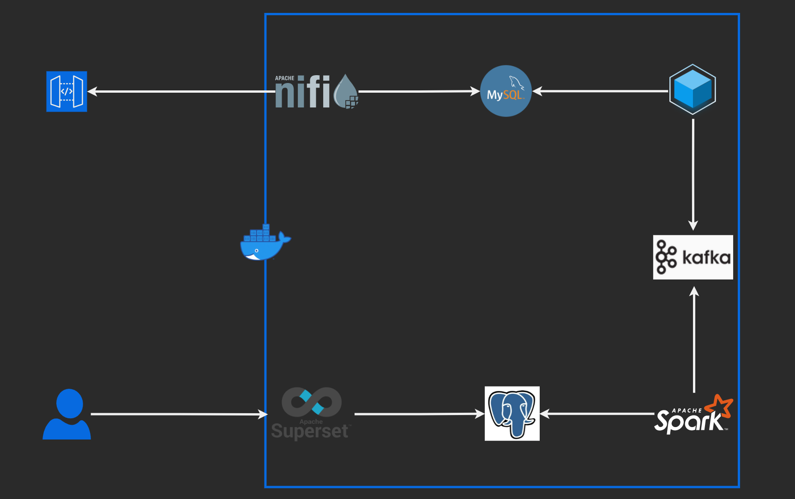

<div id="top"></div>

<!-- PROJECT LOGO -->
<br />
<div align="center">
  <a href="https://github.com/codefo-O/on_prem_etl_pipeline">
    
  </a>

<h3 align="center">ETL Pipeline</h3>

  <p align="center">
    A proof of concept project to create an ETL pipeline to ingest data from a CSV/JSON file, transform, saves as parquet and visualize for analysis.
    <br />
    <a href="https://github.com/codefo-O/on_prem_etl_pipeline">View Youtube Demo </a>
  </p>
</div>

<!-- TABLE OF CONTENTS -->
<details>
  <summary>Table of Contents</summary>
  <ol>
    <li>
      <a href="#about-the-project">About The Project</a>
      <ul>
        <li><a href="#built-with">Built With</a></li>
      </ul>
    </li>
    <li>
      <a href="#getting-started">Getting Started</a>
      <ul>
        <li><a href="#prerequisites">Prerequisites</a></li>
        <li><a href="#Deployment">Deployment</a></li>
      </ul>
    </li>
    <li><a href="#usage">Usage</a></li>
    <li><a href="#license">License</a></li>
    <li><a href="#contact">Contact</a></li>
    </ol>
</details>


<!-- ABOUT THE PROJECT -->
## About The Project



The workflow for the project as per the diagram above and steps below.

Step 1: User generates file and uploads to incoming folder

Step 2: Monitor incoming folder using inotify-tools and trigger Airflow Dag

Step 3: Airflow Dag runs Spark job

Step 4: Spark generates parquet files directly to the filesystem

Step 5: Query filesystem using Drill

Step 6: Visualize data using Superset


<p align="right">(<a href="#top">back to top</a>)</p>


### Built With
* [Airflow](https://airflow.apache.org/)
* [Docker](https://www.docker.com/)
* [Drill](https://drill.apache.org/)
* [Postgres](https://www.postgresql.org/)
* [Spark](https://spark.apache.org/)
* [Superset](https://superset.apache.org/)

<p align="right">(<a href="#top">back to top</a>)</p>


<!-- GETTING STARTED -->
## Getting Started

This is an POC ETL pipeline to transform data from a csv/json file and output to parquet files, the data can then visualized for analysis.

### Prerequisites

This project can be ran on any server able to run Docker containers and inotify-tools available in EPEL.

* [Docker](https://www.docker.com/)
* [inotify-tools](https://docs.fedoraproject.org/en-US/epel/)

### Deployment

To deploy the etl_pipline solution please follow the steps below.
1. Clone the repo.
   ```sh
   git clone https://github.com/codefo-O/on_prem_etl_pipeline.git
   ```
2. Change into the work directory.
   ```sh
   cd on_prem_etl_pipeline
   ```
3. Start the Postgres container.
   ```sh
   docker run -dit --name postgres \
                           -e POSTGRES_USER=airflow \
                           -e POSTGRES_PASSWORD=airflow \
                           -e POSTGRES_DB=airflow postgres:latest
   ```
4. Start the Apache Airflow & Apache Spark container.
   ```sh
   docker run -dit --name airflow \
                            -v ${PWD}/dags:/usr/local/airflow/dags \
                            -v ${PWD}/data:/data -v ${PWD}/jars:/jars \
                            -v ${PWD}/scripts:/scripts --link postgres:postgres \
                            -p 8080:8080 codefoo/airflow-spark webserver
   ```
5. Add Admin user to Apache Airflow.
   ```sh
   docker exec -it airflow airflow users create \
                                          --role Admin \
                                          --username admin \
                                          --email admin \
                                          --firstname admin \
                                          --lastname admin \
                                          --password admin
   ```
6. Update Apache Airflow database.
   ```sh
   docker exec -it airflow airflow db upgrade
   ```
7. Start Apache Airflow scheduler for the first time.
   ```sh
   docker exec -dit airflow airflow scheduler
   ```
8. Start the Apache Drill container.
   ```sh
   docker run -dit --name drill -v ${PWD}/data:/data -p 8047:8047 apache/drill:latest
   ```
9. Start the Apache Superset container.
   ```sh
   docker run -dit --name superset -p 8088:8088 codefoo/superset-sqlalchemy:latest
   ```
10. Add Admin user to Apache Superset. 
    ```sh
    docker exec -it superset superset fab create-admin \
                                           --username admin \
                                           --firstname Superset \
                                           --lastname Admin \
                                           --email admin@superset.com \
                                           --password admin
    ```
11. Update Apache Superset database.
   ```sh
   docker exec -it superset superset init
   ```
12. Start monitor for files in /data/incoming.
   ```sh
   cd data
   ./monitor_incoming.sh
   ```

<p align="right">(<a href="#top">back to top</a>)</p>


<!-- USAGE EXAMPLES -->
## Usage

Once you have completed all the steps above and started monitor incoming you can test by copying one of the test files in the data folder.
 ```sh
   cp *_Records.csv incoming/ 
 ```
The procssed files will be moved to /data/processed and failed will be moved to /data/failed

<p align="right">(<a href="#top">back to top</a>)</p>


<!-- LICENSE -->
## License

Distributed under the Apache 2.0 License. See `LICENSE.txt` for more information.

<p align="right">(<a href="#top">back to top</a>)</p>


<!-- CONTACT -->
## Contact

Gurjot Singh - GurjotSingh@rogers.com

Project Link: [https://github.com/codefo-O/on-prem_etl_pipeline](https://github.com/codefo-O/on-prem_etl_pipeline)